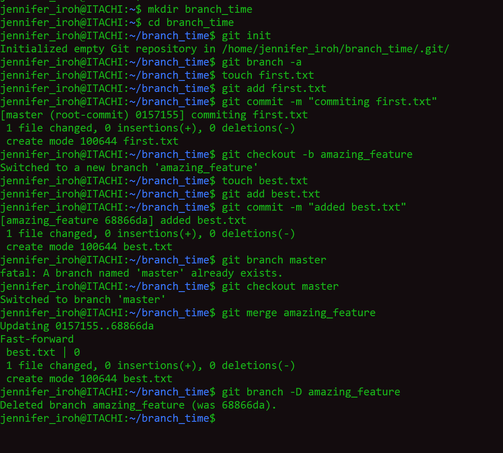

# Exercise

1.	Create a folder called branch_time.
2.	cd into that folder.
3.	Initialize an empty git repository.
4.	Create a file called first.txt, then add and commit the file.
5.	Create a new branch called amazing_feature.
6.	Create a file called best.txt.
7.	Add the file.
8.	Commit the file with the message -m "added best.txt".
9.	Switch back to the master branch.
10.	Merge your changes from the feature branch into master.
11.	Delete the feature branch.

# Solution

