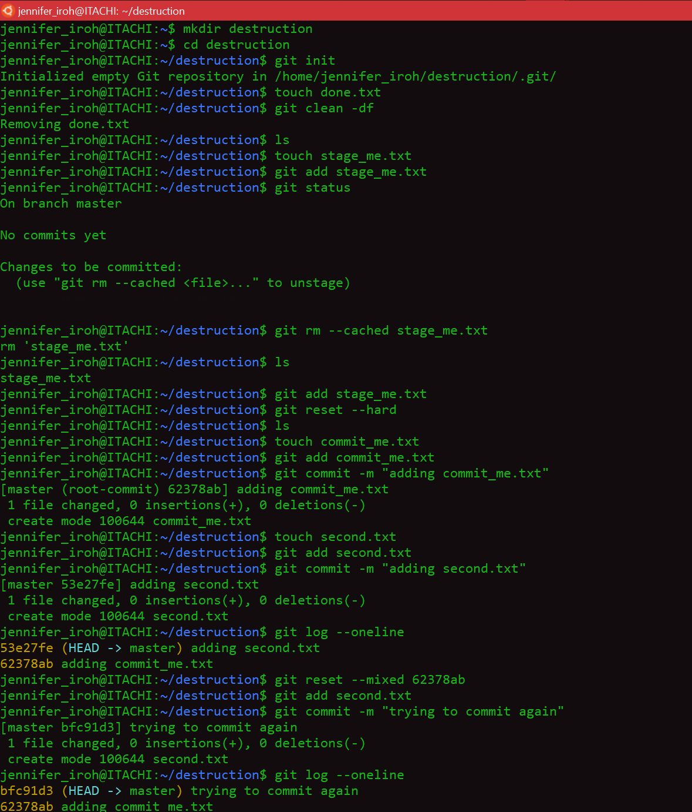
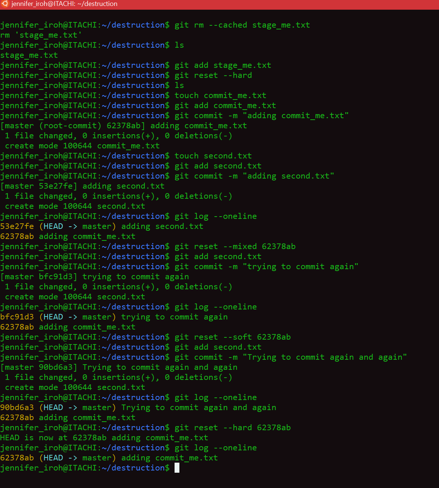

# Checkout and Reset

1.	Create a folder called destruction.
2.	cd into that folder.
3.	Initialize an empty git repository.
4.	Create a file called done.txt.
5.	Remove that file from the working directory (remember you can not use git checkout).
6.	Create a file called stage_me.txt.
7.	Add stage_me.txt file to the staging area.
8.	Move stage_me.txt file from the staging area to the working directory.
9.	Add stage_me.txt file to the staging area.
10.	Remove stage_me.txt from the staging area and the working directory.
11.	Create a new file called commit_me.txt.
12.	Add commit_me.txt to the staging area.
13.	Commit with the message "adding commit_me.txt".
14.	Create another file called second.txt.
15.	Add second.txt to the staging area.
16.	Commit with the message "adding second.txt".
17.	Check out your previous commits using git log --oneline to see the unique identifier or SHA for each of your commits.
18.	Using git reset, undo the previous commit and move your changes back to the working directory.
19.	Add second.txt again.
20.	Commit with the message "Trying to commit again".
21.	Using git reset undo the previous commit and move your changes back to the staging area.
22.	Commit with the message "Trying to commit again and again".
23.	Using git reset undo the previous commit so that any changes are not part of the working directory.

# Answers

