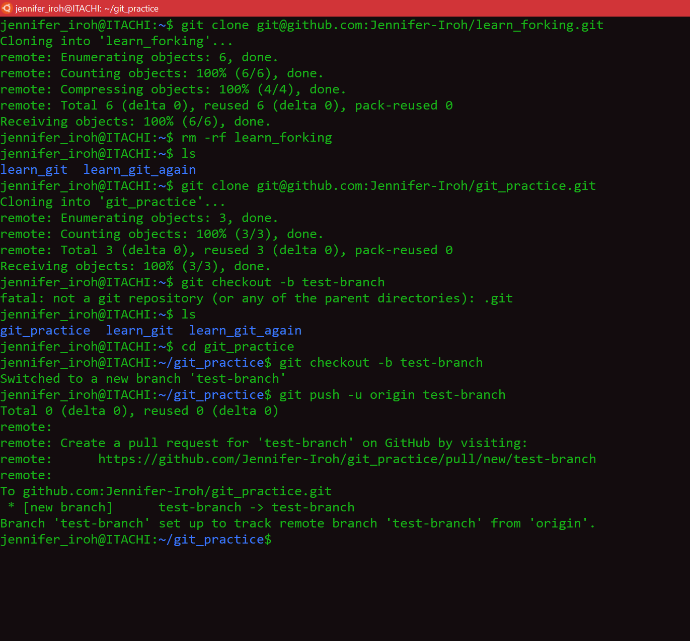
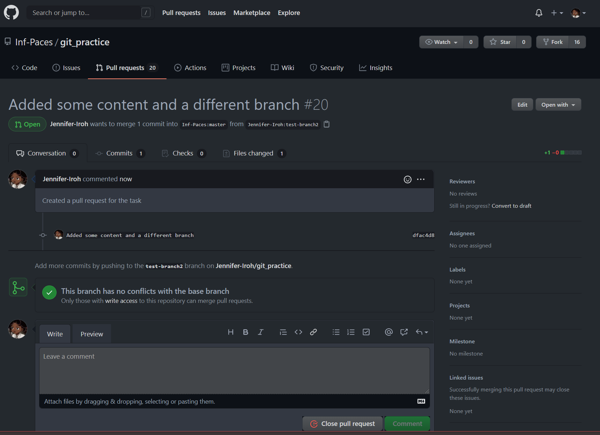

# GitHub Exercises – Part I

1.	Create a local repository and add and commit some files
2.	Create a remote repository and push your code from the local repo to the remote

Answer: Number 1 and 2 have been done. All files pushed can be seen inn this repo: https://github.com/Jennifer-Iroh/Techjobs-3.0-Tasks

3.	Fork the repo https://github.com/inf-paces/git_practice - clone it and submit a pull request
4.	Create a new branch locally and push it to GitHub
5.	Submit a pull request with your new branch against the master branch on the git_practice repo.

# Solution

